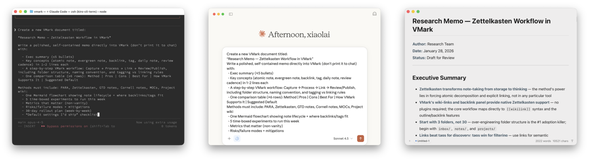

# TMark

**A public Tauri/React plain-text workspace derived from [xiaolai/vmark](https://github.com/xiaolai/vmark).**

TMark is a snapshot-based derivative of Li Xiaolai's VMark project. It keeps the same core idea: humans and AI should be able to work on the same local plain-text artifacts directly, without a translation layer.

This repository was created from a current VMark-based worktree snapshot on 2026-05-12. It does **not** preserve the original Git history. For upstream history, design context, and original project evolution, see [xiaolai/vmark](https://github.com/xiaolai/vmark).

<p align="center">
  
</p>

## What It Is

TMark is a local-first desktop workspace for Markdown and adjacent plain-text formats:

- Markdown with WYSIWYG, source peek, and full source mode.
- JSON, JSONL, YAML, TOML, Mermaid, SVG, HTML, plain text, and code-oriented files.
- Schema-aware previews for known artifacts such as GitHub Actions workflows, `Cargo.toml`, `package.json`, and `pyproject.toml`.
- MCP-oriented AI integration so assistants can read and write the same files you are editing.
- CJK-aware formatting rules for Chinese, Japanese, and Korean text.

## Relationship To VMark

TMark is based on [VMark](https://github.com/xiaolai/vmark), produced by [@xiaolai](https://github.com/xiaolai).

The initial TMark import was made as a clean public repository under [Afeng01/TMark](https://github.com/Afeng01/TMark), using only the then-current source snapshot. Original VMark commit history, releases, website, Homebrew tap, and project governance belong to the upstream repository unless explicitly re-established here.

## Current Status

This repo has completed its initial TMark snapshot rebrand:

- The public repository name and app identity now use TMark.
- Historical VMark documentation is retained where it describes upstream history or inherited context.
- Release, website, and Homebrew automation should be treated as under review until explicitly enabled.

## Build From Source

Prerequisites:

- [Node.js](https://nodejs.org/) 20+
- [pnpm](https://pnpm.io/) 10+
- [Rust](https://www.rust-lang.org/tools/install), stable
- [Tauri v2 prerequisites](https://v2.tauri.app/start/prerequisites/)

```bash
git clone https://github.com/Afeng01/TMark.git
cd TMark
pnpm install
pnpm tauri dev
pnpm tauri build
```

Useful checks:

```bash
pnpm test
pnpm build
pnpm lint
```

The upstream VMark README uses `pnpm check:all` as the full gate. TMark keeps that script, but during the rebrand phase it may expose inherited website, coverage, or release-config issues that are not yet part of the public TMark baseline.

## AI And MCP

The codebase includes an MCP sidecar and AI-oriented workflow support inherited from VMark. During the TMark rebrand, MCP server names, tool namespaces, and compatibility behavior should be reviewed carefully before publishing packages or release artifacts.

## Contributing

Use issues for bugs, feature requests, and rebrand gaps. External pull requests should be small and focused until the project finishes the first TMark stabilization pass.

## License

ISC License. See [LICENSE](LICENSE).

## Attribution

TMark is derived from [xiaolai/vmark](https://github.com/xiaolai/vmark). Keep this attribution in downstream distributions unless the project is substantially rewritten and relicensed under a different documented arrangement.
